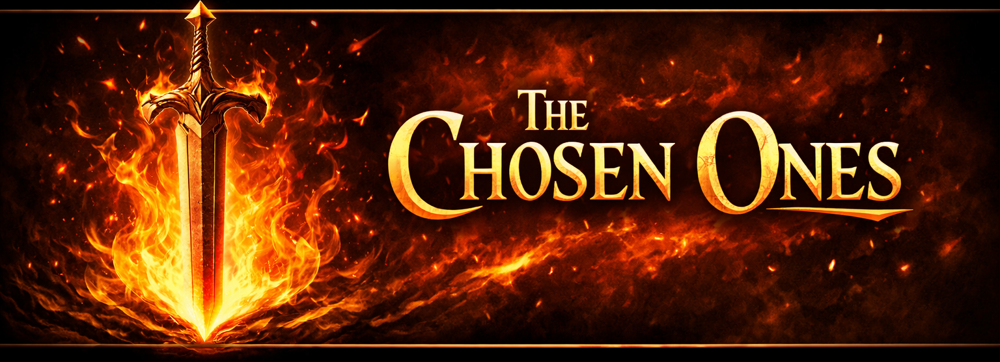

# v1.0.14

**Would you like to begin your adventure as one of the chosen by the destiny?**

The Chosen Ones reshapes the opening moments of your journey by granting access to a powerful pool of legendary equipment right at the start of the run. Instead of waiting for chance or progression, players are invited to select from a curated selection of high-tier gear and shape their strategy from the very first step.

The true strength of this mod lies not in raw power, but in freedom. By unlocking legendary options early, players can experiment with unconventional builds, explore new synergies, and fully realize character concepts that might otherwise take an entire run to assemble.

Whether you are testing ideas, refining strategies, or simply embracing a power-fantasy start, The Chosen Ones empowers you to play the way you imagine from the very beginning. 

This **Across the Obelisk** mod is designed for experimentation and players who want to begin their journey already feeling legendary.

## Features

* Opens a custom loot selection at the **very first node (Act 0)**
* Provides a curated list of **Epic and Mythic equipment**
* Fully compatible with **r2modman** and **Thunderstore**
* Lightweight and safe to add or remove

## How It Works

When a new run starts, the mod triggers a custom loot event that allows the player to pick from a predefined pool of high-tier equipment.

The loot is defined using Obeliskial JSON content files and loaded through the official content pipeline.

## Requirements

This mod requires the following dependencies:

* BepInEx 5
* Obeliskial Essentials
* Obeliskial Content

Make sure all dependencies are installed before launching the game.

## Installation

### Using r2modman (Recommended)

1. Open r2modman
2. Select **Across the Obelisk**
3. Search for **The Chosen Ones**
4. Install the mod
5. Launch the game

[Install Here](https://thunderstore.io/c/across-the-obelisk/p/ScotilenTeam/TheChosenOnes/)

## Compatibility

* Works with single-player and multiplayer
* Safe to use with most content and balance mods. Just make sure you have the same checksum!
* Does not modify save files

## Intended Use

This mod is ideal for:

* Testing builds quickly
* Power fantasy runs
* Experienced players who want faster progression

## Feedback and Issues

If you encounter bugs or have suggestions, please report them on the official Across the Obelisk discord server.

Enjoy your run, and may you truly be one of **The Chosen Ones**.

## Credits
- A big thanks to Ameu for helping me out with the testing of the multiplayer, and suggesting so many ideas!
- Thanks VidereJP for playing it with us
- A big thanks to Binbin for making it easy to load new content to the game!
